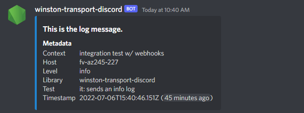
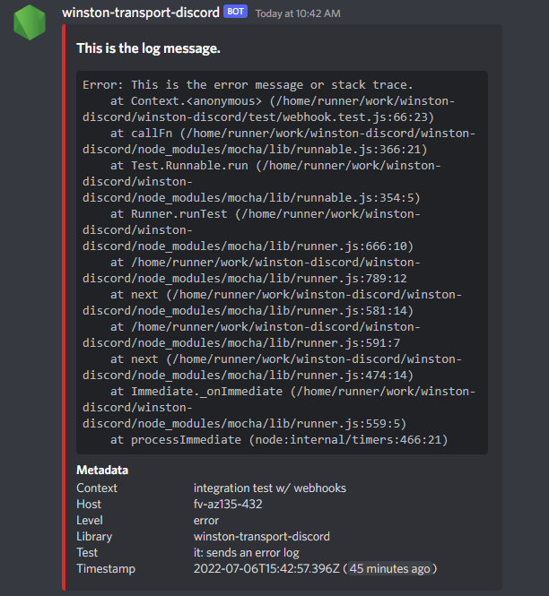

# winston-transport-discord

[](https://www.npmjs.com/package/winston-transport-discord) &nbsp; [](https://github.com/robhimslf/winston-transport-discord/actions/workflows/tests.yaml) &nbsp; [](https://github.com/robhimslf/winston-transport-discord/actions/workflows/release.yaml)

[Winston](https://github.com/winstonjs/winston) logging transport for emitting log entries to a Discord channel.

## Compatibility

- Node 16+
- Winston 3

## Installation

```
# npm
npm install winston-transport-discord

# yarn
yarn add winston-transport-discord
```

## Usage

### JavaScript

```js
const winston = require( 'winston' );
const DiscordTransport = require( 'winston-transport-discord' );

// Create the transport.
const transport = new DiscordTransport({
    discord: {
        webhook: {
            url: 'https://discord.com/api/webhooks/123456789012345678/AbCDefGhIJKLmnOpqRStUVwXyZaBCDefGHiJK_lMnoPQRsTuVWXyZAbcDefGHiJKlmnO'
        }
    }
});

// Create the logger.
const logger = winston.createLogger({
    transports: [ transport ]
});

// Use it w/ full options.
logger.log( 'info', 'This is the log message.' );

// Use it w/ helper methods.
logger.info( 'This is the log message.' );
```

### Typescript

```typescript
import winston from 'winston';
import DiscordTransport, { DiscordTransportOptions } from 'winston-transport-discord';

// Create options to illustrate typing.
const options: DiscordTransportOptions = {
    discord: {
        webhook: {
            url: 'https://discord.com/api/webhooks/123456789012345678/AbCDefGhIJKLmnOpqRStUVwXyZaBCDefGHiJK_lMnoPQRsTuVWXyZAbcDefGHiJKlmnO'
        }
    }
};

// Create the transport.
const transport = new DiscordTransport( options );

// Create the logger.
const logger = winston.createLogger({
    transports: [ transport ]
});

// Use it w/ full options.
logger.log( 'info', 'This is the log message.' );

// Use it w/ helper methods.
logger.info( 'This is the log message.' );
```

## Handler Configuration

Both bot- and webhook-based log handling is supported, though webhooks are preferred due to their simplicity for Discord server administrators as well as this library.

### Webhooks (Preferred)

#### Create a Webhook

1. Open Discord.
2. Navigate to the Discord server in which log entries will be sent.
3. Open the server settings, and click "Integrations".
4. Click "New Webhook", and provide:
    * **Avatar:** *Optionally* upload an avatar image to display with log messages.
    * **Name:** Webhook name as it will appear as the author of log messages.
    * **Channel:** Text channel in which log messages will be sent.
5. Click "Save Changes".
6. Click "Copy webhook URL", and keep it handy.

#### Webhook Options

The webhook handler can be configured in one of two ways:

**Explicitly in transport options:**

```js
const winston = require( 'winston' );
const DiscordTransport = require( 'winston-transport-discord' );

// Create the transport.
const transport = new DiscordTransport({
    discord: {
        webhook: {
            url: 'PASTE THE WEBHOOK URL HERE'
        }
    }
});

// ...
```

**Environment variables:**

Using a package like [dotenv](https://github.com/motdotla/dotenv) or some other means of configuring a Node environment variable, set the value of `DISCORD_LOGGING_WEBHOOK_URL` to the webhook URL. No other options are needed.

```txt
# .env File
DISCORD_LOGGING_WEBHOOK_URL="PASTE THE WEBHOOK URL HERE"
```

```js
const dotenv = require( 'dotenv' );
const winston = require( 'winston' );
const DiscordTransport = require( 'winston-transport-discord' );

// Run this before anything else.
dotenv.config();

// Create the transport.
const transport = new DiscordTransport();

// ...
```

### Bots

Prior to using this handler it's necessary to [create a bot application](https://discord.com/developers/applications) in Discord, and invite that bot to your Discord server. From the bot application's page in the Discord Developer Portal you'll need to make note of the token generated in the Bot Settings page.

You'll also need to acquire a channel ID from the text channel in your Discord server in which you want the logs to be sent.

### Acquire a Channel ID

1. Open Discord.
2. Click the settings cog icon in the bottom-left corner.
3. Click "Advanced" beneath "App Settings" on the left of the settings view.
4. Ensure that "Developer Mode" is *enabled*.
5. Close Settings, and navigate to the Discord server in which log entries will be sent.
6. Find the desired text channel in the channel list, right-click it, and select "Copy ID" at the bottom of the context menu.

#### Bot Options

The bot handler can be configured in one of two ways:

**Explicitly in transport options:**

```js
const winston = require( 'winston' );
const DiscordTransport = require( 'winston-transport-discord' );

// Create the transport.
const transport = new DiscordTransport({
    discord: {
        bot: {
            channel: 'PASTE THE CHANNEL ID HERE',
            token: 'PASTE THE BOT TOKEN HERE'
        }
    }
});

// ...
```

**Environment variables:**

Using a package like [dotenv](https://github.com/motdotla/dotenv) or some other means of configuring a Node environment variable, set the value of `DISCORD_LOGGING_BOT_CHANNEL` to the channel ID and the value of `DISCORD_LOGGING_BOT_TOKEN` to the bot token. No other options are needed.

```txt
# .env File
DISCORD_LOGGING_BOT_CHANNEL="PASTE THE CHANNEL ID HERE"
DISCORD_LOGGING_BOT_TOKEN="PASTE THE BOT TOKEN HERE"
```

```js
const dotenv = require( 'dotenv' );
const winston = require( 'winston' );
const DiscordTransport = require( 'winston-transport-discord' );

// Run this before anything else.
dotenv.config();

// Create the transport.
const transport = new DiscordTransport();

// ...
```

## Metadata and Error Logging

### Metadata

Log messages will always contain metadata fields of `host`, `level`, and `timestamp`. You may also provide additional metadata at both the global and log message levels as well. Both expect simple key-value string pairs.

#### Global Metadata

Global metadata - included with every log entry - is set in the transport options. This example adds service name and author:

```js
const winston = require( 'winston' );
const DiscordTransport = require( 'winston-transport-discord' );

// Create the transport.
const transport = new DiscordTransport({
    metadata: {
        service: 'My Application',
        author: '<@some-discord-id>'
    }
});

// ...
```

#### Entry Metadata

Entry metadata is only included with its parent log entry. This example adds class and function name:

```js
// ...Winston already setup with transport.

// Dummy metadata.
const meta = {
    class: 'MyClass',
    function: 'someFunction'
};

// Use it w/ full options.
logger.log( 'info', 'This is the log message.', { meta });

// Use it w/ helper methods.
logger.info( 'This is the log message.', { meta });
```

### Error Logging

If an error has been sent with a log entry it will be shown as the description of the log message embed automatically, but only if the log level is `error`. For example:

```js
// ...Winston already setup with transport.

// Dummy error.
const error = new Error( 'Uh oh!' );

// Use it w/ full options.
logger.log( 'error', 'Something bad happened.', error );

// Use it w/ helper methods.
logger.error( 'Something bad happened.', error );
```

## Example Output

### Info



### Error


